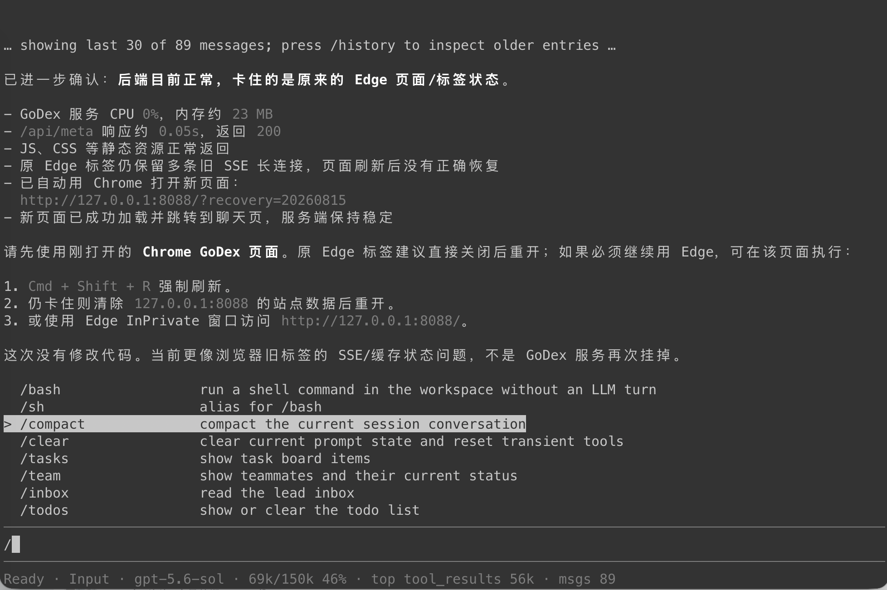
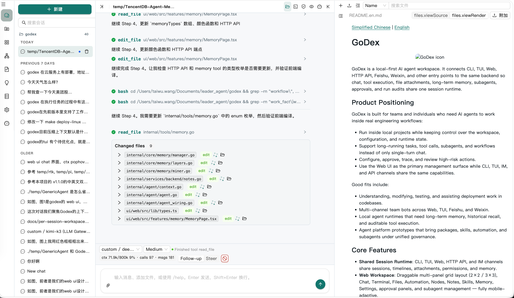
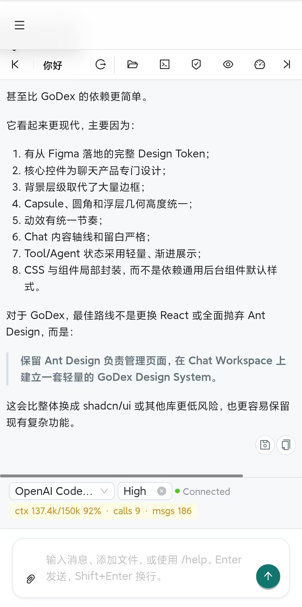

[Simplified Chinese](README.md) | [English](README.en.md)

# GoDex

<p align="center">
  
</p>

GoDex is a local-first AI agent workspace. It connects CLI, TUI, Web, HTTP API, Feishu, Weixin, and other entry points to the same backend so chat, tool execution, file attachments, long-term memory, subagents, approvals, and run audits share one session runtime.

## Screenshots

### tui


### web ui


### web ui in mobile

Running a telemetry session

## Product Positioning

GoDex is built for teams and individuals who need AI agents to work inside real engineering workflows:

- Run inside local projects while keeping control over the workspace, configuration, and runtime state.
- Support long-running tasks, tool calls, subagents, and workflows instead of only single-turn chat.
- Configure, approve, trace, and review high-risk actions.
- Use the Web UI as the primary management surface while CLI, TUI, IM, and API channels share the same capabilities.

Good fits include:

- Understanding, modifying, testing, and assisting deployment work in codebases.
- Multi-channel team bots across Web, TUI, Feishu, and Weixin.
- Local agent runtimes that need long-term memory, historical recall, and auditable tool execution.
- Agent platform prototypes that bring packages, skills, automation, and subagents under unified governance.

## Core Features

- **Shared Session Runtime**: CLI, TUI, Web, HTTP API, and IM channels share sessions, timelines, attachments, permissions, and memory.
- **Web Workspace**: Draggable multi-panel grid layout (2×2 / 3×3), Chat, Terminal, Files, Automation, Nodes, Notes, Skills, Memory, Usage, Settings, approval panels, and subagent management — fully mobile-adaptive.
- **Multi-provider Management**: Anthropic-compatible providers, OpenAI-compatible providers, the OpenAI Codex provider, model policies (primary/fallback/round_robin), dynamic Web Settings configuration, and an OpenAI-compatible `/v1/*` API.
- **Resilient Long Tasks**: Ralph-style LongTask story loop (dynamic parallel DAG), auto-repair, validation artifacts, auto merge/commit, runner phase checkpoints, restart recovery (`--resume-run-id`), in-flight follow-up/steering, and per-role context budgets.
- **Agent Graph and Multi-Engine**: `agent_graph` dynamic DAG abstraction, durable `workflow` runtime, Harness engine abstraction with per-turn hot engine switching.
- **Agent Identity / Sandbox Decoupling**: `Sandbox` interface + `LocalSandbox`, scope isolation (session/personal/org) with write-path restriction.
- **Context and Memory**: Model-assisted compression with pinned continuation snapshots, rule-based fallback, transcript archive, `history_search`, durable memory, candidate inbox, suppression, audit/restore, memory strategies (per-turn/agent-only/consolidated), compact memory injection, and token estimation.
- **Agent Profile**: CLI/TUI/ACP default to the focused `coding` prompt policy, while Web/IM default to the broader `general` policy; tool exposure is identical and can be overridden per entry point or command.
- **Tools and Safety**: merge, grep (ripgrep dual-backend), edit_file multi-edit, LSP code intelligence, WorkspaceFS file boundaries, shell guard, manual/review/yolo approval modes, security profiles, content security screener, loop guard, and security audit.
- **Subagent and Workflow**: Durable subagent jobs, role→bundle mapping with write-scope linkage, review/merge/cancel/resume/iterate, LongTask surfaces for Web/CLI/API, capability boundaries, isolated workspace strategies, and compact handoff.
- **Package and Skill Ecosystem**: Package manifests (resources/app/tool_policy/smoke_tests/recommended_bundles), `requires`/`provides` dependency declarations with install-time dependency graph validation (missing/conflict/cycle), uninstall dependency protection, transactional reinstall, role/command contracts, tool policies, quality diagnostics, smoke runs, reinstall tracking, and Claude Code import.
- **Automation and Channels**: Cron (at/every/cron schedules), Heartbeat (HEARTBEAT.md checklist + OK token), Feishu, Weixin, and OpenAI-compatible chat completions API; IM approval messages show the tool and key parameter summary.
- **Control Plane Foundation**: Lightweight Node Registry and read-only Nodes Dashboard for observing multiple GoDex runtimes; Relay hub (outbound WSS join), `node exec/forward` jump-host, and `guarded-remote` approval headers.
- **Notes Workspace**: Local Markdown notes, search/tags, saving agent output from Chat into notes, and bidirectional notes↔memory linkage.
- **Session Tree**: branchable sessions (fork/rollback/merge) with a persisted session graph.
- **Storage Governance**: Storage doctor plus browser cache, session checkpoint, artifact, and subagent garbage collection.
- **Terminal**: Real Go PTY backend + xterm.js frontend for a native shell experience.
- **Usage Tracking**: LLM token usage records (SQLite), Web Usage panel, and `/usage/*` API.
- **Performance**: Anthropic-style cache_control breakpoints, prompt caching, and compaction optimizations.
- **Single-binary Web UI**: Web dist embedded in Go binary, cross-platform (Linux/macOS/Windows) single-file deployment.

## Quick Start

### Requirements

- Go `1.26+`
- Node.js + `pnpm`, only required when building the Web frontend
- At least one available LLM provider

### Run from Source

```bash
go mod download
pnpm -C ui/web install
pnpm -C ui/web build
go run ./cmd/godex serve --addr 127.0.0.1:8080
```

Open:

```text
http://127.0.0.1:8080
```

### Initialize a Project

```bash
go run ./cmd/godex setup --dir /path/to/project
```

On first startup, if the configuration file does not exist, GoDex creates a commented default configuration.

### Configure Models

The recommended path is to use Web `Settings` to manage providers, models, and key references. You can also log in from the CLI:

```bash
godex login openai --mode platform-api-key
godex login codex --mode codex-oauth
godex providers list
godex providers test <provider-id>
```

Global configuration and default runtime data live under `~/.godex`: providers, skills, sessions, memory, tmp/cache, logs, and related files are not written to the current project directory by default. Project directories only keep explicitly created project files such as `godex.yaml`, `.env.example`, and `AGENT.md`. For details, see [docs/user-guide.md](docs/user-guide.md).

## Common Entry Points

```bash
# Interactive CLI
go run ./cmd/godex

# One-off questions. CLI/TUI/ACP use the coding profile by default.
go run ./cmd/godex ask "Summarize the current repository structure"
go run ./cmd/godex ask --profile general "Help me plan a product proposal"

# Run a slash command
go run ./cmd/godex command /doctor

# Inspect and clean local runtime storage
go run ./cmd/godex doctor storage
go run ./cmd/godex gc --dry-run

# Full-screen TUI, also the default entry point
go run ./cmd/godex

# Web / HTTP / SSE / channel runtime
go run ./cmd/godex serve --addr 127.0.0.1:8080

# Import Claude Code ecosystem resources
go run ./cmd/godex import claude --source .claude --dry-run
```

For more commands, slash commands, and HTTP API details, see [docs/user-guide.md](docs/user-guide.md).

## Web Workspace

The Web UI is currently the most complete product entry point:

- **Chat**: Multi-entry sessions, attachments, approvals, model switching, Context & Recall, timeline, subagent progress, saving agent output into Notes, and session forking.
- **Files**: File tree, code editor, diff, and search (within the workspace boundary).
- **Settings**: Global/project configuration paths, providers/models, doctor, channel status, security policies, and service runtime status.
- **Nodes**: Read-only observation of local and manually/automatically registered GoDex runtimes, with remote Chat/Terminal/Files.
- **Notes**: Local Markdown notes, tags, search, editing, and Chat integration.
- **Memory**: Durable memory, candidate inbox, suppression, audit diff, and restore/reapply.
- **Skills**: Package/skill management, quality diagnostics, smoke runs, and reinstall.
- **Automation**: Cron, Heartbeat, and run logs.
- **Usage**: LLM usage, model/key management, and cache hit statistics.

Build the frontend (outputs directly to Go embed directory):

```bash
pnpm -C ui/web build
```

The package development flow can use the example skill:

```text
examples/skills/package-developer
```

After installing this local skill from the Web `Skills` installer or Chat, load `package-developer` to get guidance for creating `godex.package.yaml`, running smoke tests, installing GitHub packages, reinstalling, and uninstalling.

## Telemetry

GoDex is local-first: **no data is reported to any external service by default**. Telemetry has two layers, and both only work when you explicitly enable them:

- **Control Plane node telemetry**: when a node configures `control.center_url` + `control.credential` and joins a center, the node periodically pushes a local runtime snapshot to the center over the relay — running sessions (id/title/running/updated_at), longtask progress (status/phase/turn/total), pending approval requests (tool/action/paths), plus the node version and capabilities. The center's **Nodes** page and `GET /control/nodes/{id}/overview` render this live progress (as shown in the mobile telemetry screenshot above). **Without joining a center (the default) no push happens at all**; snapshots contain summary-level state only, full session history always stays on the node, and the center only observes read-only without storing session content.
- **LLM usage tracking**: token usage and cache hits for every model call are recorded into a local SQLite store (the `usage` service) and surfaced through the Web **Usage** panel and the `/usage/*` API — for cost/usage statistics only, never uploaded.

Privacy boundary: all telemetry data lives under `~/.godex` locally; only an explicitly configured center join pushes the summary state above, and the center never persists full session history.

## Agent Profile

`agent.profile` is an entry-point/task prompt policy that controls the default response style and capability-usage guidance; it does not replace `security.profile`. The default entry-point policy is:

- `acp`, `cli`, `tui`: `coding` — the prompt directs the agent to follow a lean coding workflow (concise replies, read code before editing, prefer the `lsp` tool) and to enable heavier bundles (web/browser/subagent/etc.) via `tool_exchange` only when the user explicitly asks.
- `web`, `weixin`, `feishu`: `general` — the full workspace experience (including skill catalog injection).

Note: the tool catalog is identical for both profiles (same always-active / default-active tool set); the difference is the system prompt and injected runtime sections (coding replaces the skill catalog with a repo map). CLI/TUI/ACP can temporarily override with `--profile general|coding`; `GODEX_AGENT_PROFILE` or Web `Settings` → `agent.default_profiles.*` also work.

## Milestones

### Current Baseline (implemented as of 2026-08)

GoDex 1.x is already a local-first, deployable, auditable agent workspace:

**Runtime and Resilience**
- One shared session runtime across CLI, TUI, Web, HTTP API, Feishu, Weixin, Cron, and Heartbeat.
- Async turn runtime with a durable event journal and checkpoints; idempotent storage (cron/heartbeat); worker leases (crashes are marked `interrupted`, never auto-rerun); restart recovery.
- Turn error layering (Retryable/Transient/NonRetryable), loop guard (no-mutation spiral detection), runner phase checkpoints, and empty-reply/`finish_reason=length` recovery.
- Harness multi-engine abstraction with per-turn engine hot-switching.

**Multi-Agent Orchestration**
- Durable subagent jobs: review/merge/cancel/resume/iterate, role→bundle mapping with write-scope linkage, per-role context budgets, and compact handoff.
- `workflow` and `agent_graph`: dynamic parallel DAGs (data_dependency / control_flow / handoff edges), recoverable across restarts.
- LongTask story loop: compile PRD/user stories into dynamic parallel DAGs, auto-repair, validation artifacts, auto merge/commit, and `--resume-run-id` continuation.
- Branchable sessions (fork/rollback/merge) with a persisted session graph.

**Context and Memory**
- Model-assisted compression with pinned continuation snapshots, rule-based fallback, transcript archive, and `history_search`.
- Durable memory: candidate inbox, suppression, audit/restore, SQLite + FTS5 sidecar, scope-aware recall, project miner, memory strategies (per-turn/agent-only/consolidated), and foldCapture dedup.
- Bidirectional notes↔memory linkage, context inspector, and token estimation.

**Tools and Safety**
- 60 tools across 14 bundles: shell/file/grep(ripgrep)/LSP/browser/desktop/web/memory/skill/package/subagent/workflow/MCP/teamtools, with on-demand activation via `tool_exchange`.
- WorkspaceFS file boundaries, shell guard, manual/review/yolo approval, security profiles (trusted-local … dev/repair), content security screener, loop guard, and security audit.
- Scope isolation (session/personal/org) with write-path restriction.

**Ecosystem and Governance**
- Package/Skill ecosystem: manifests (resources/app/tool_policy/smoke_tests/recommended_bundles), quality diagnostics, smoke runs, reinstall, and Claude Code import.
- Automation and channels: Cron (at/every/cron), Heartbeat (HEARTBEAT.md checklist + OK token), Feishu, Weixin, and the OpenAI-compatible `/v1/*` API.
- Control Plane: Node Registry + Relay hub (outbound WSS join), `node exec/forward` jump-host, and `guarded-remote` approval headers.
- Storage doctor/GC, LLM usage tracking, single-binary Web UI, and self-managed `service install`.

### GoDex 2.0 Planning (in progress)

GoDex 2.0 aims to evolve from a single large agent workspace into an agent runtime platform that can carry heavy workloads. Current progress:

| Direction | Status | Notes |
|----------|--------|-------|
| **Agent / Sandbox Decoupling** | ✅ interface landed | `Sandbox` interface + `LocalSandbox` + scope isolation (roadmap 3.3/6.2); future work is more backends (WASM, remote) |
| **Orchestrator / Worker Decoupling** | 🚧 in progress | Durable subagent/workflow/longtask runtime exists; target is a cleaner worker runtime protocol and capability boundaries |
| **Session Memory Tree** | 🚧 partially landed | fork/rollback/merge implemented (`sessiongraph`); target is fuller versioned context (clone, rebuild, cross-storage) |
| **Session / Storage Decoupling** | ✅ dual backend | JSON + SQLite mirror (`sessionstore`); future: databases and cloud storage |
| **Unified Plugin Kernel** | 📋 planned | Plugin Kernel + optional WASM executor + full MCP client; see the [DSH research notes](docs/research_of_dsh_for_godex_optimize.md) |

See the [GoDex 2.0 Architecture SPEC](docs/architecture-v2-spec.en.md) for the detailed direction.

## Documentation

The full index (status, category, and relationships for every doc) lives in **[docs/README.md](docs/README.md)**; the documentation organization plan (DSH benchmark, reader layers, per-doc treatment) is in [docs/documentation-organization-plan.md](docs/documentation-organization-plan.md).

Quick start by reader:

- **End users**: [User Guide](docs/user-guide.md), [Extension Runtime Guide](docs/extension-runtime-user-guide.md) (Package/MCP/ACP/WASM), [VS Code ACP](docs/vscode-acp.md)
- **Developers**: [Architecture SPEC](docs/architecture-v2-spec.en.md), [Project Structure](docs/project-structure.md), [Feature-to-implementation Matrix](docs/feature-implementation-matrix.md), [Optimization Roadmap](docs/godex-optimization-roadmap.md)
- **Ops**: [Self-deployment Guide](docs/self-deploy.md), [Node Onboarding](docs/node-onboarding.md), [Node Mesh](docs/node-mesh-design.md)

> All other design and historical docs are indexed in [docs/README.md](docs/README.md).

## Directory Structure

```text
cmd/godex/        CLI binary entry point
internal/app/     CLI, serve, and slash command assembly
internal/agent/   agent loop, context, turn runtime, subagents, harness engines, agent graph
internal/runtime/ HTTP/Web UI, IM channels, Cron, Heartbeat
internal/services/ backend, commands, historysearch, noderegistry, relay, sessionadmin, usage, eval
internal/tools/   bash/file/browser/web/memory/skill/package/subagent/teamtools and other tools
internal/toolruntime/  typed tool framework, permissions, interceptors, execution context
internal/sandbox/ Sandbox interface and LocalSandbox (Agent Identity decoupling)
internal/core/    config, conversation, compression, memory, notes, skill, package, media, mcp, security, scope
internal/domain/  shared cross-layer domain types (events, message, security, eval, ...)
internal/sessiongraph/  branchable session graph
internal/sessionstore/  session storage backends (json / sqlite)
internal/platform/  fs, logger, workspace paths, tooling, storagegc infrastructure
internal/tui/     min-tui fullscreen frontend
internal/uiassets/ embedded Web dist
internal/acp/     ACP stdio server
ui/web/           React + Vite Web frontend
docs/             Product, architecture, validation, and deployment docs
```

For a fuller explanation, see [docs/project-structure.md](docs/project-structure.md).

## Release Check

Before release, run:

```bash
./scripts/release_check.sh
```

It runs Go tests, builds the Go binary, and builds the Web frontend. Locally, you can also run them separately:

```bash
go test ./...
pnpm -C ui/web build
make docs-check
git diff --check
```
